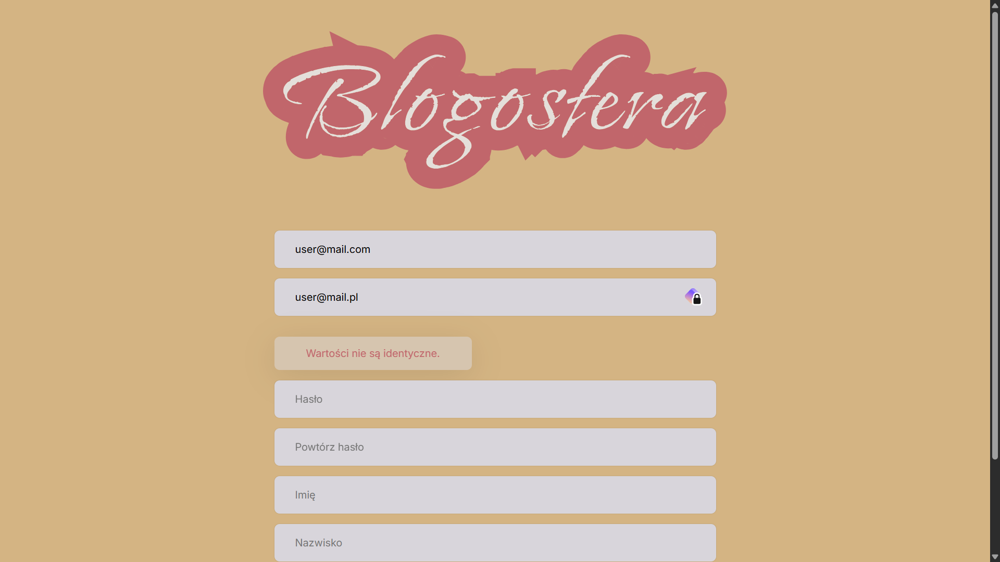
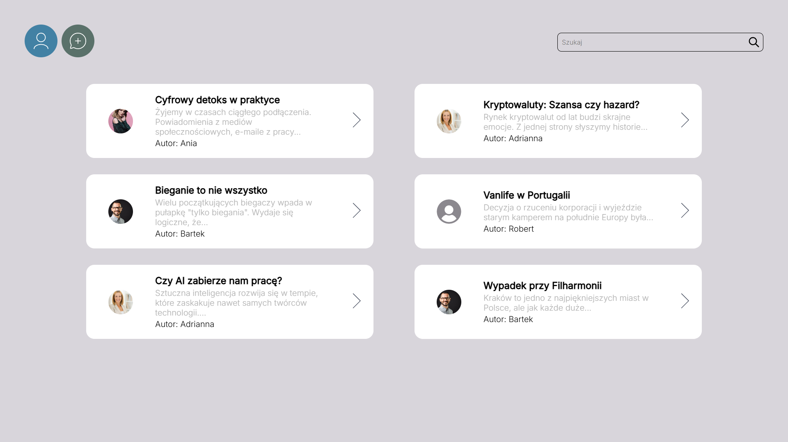
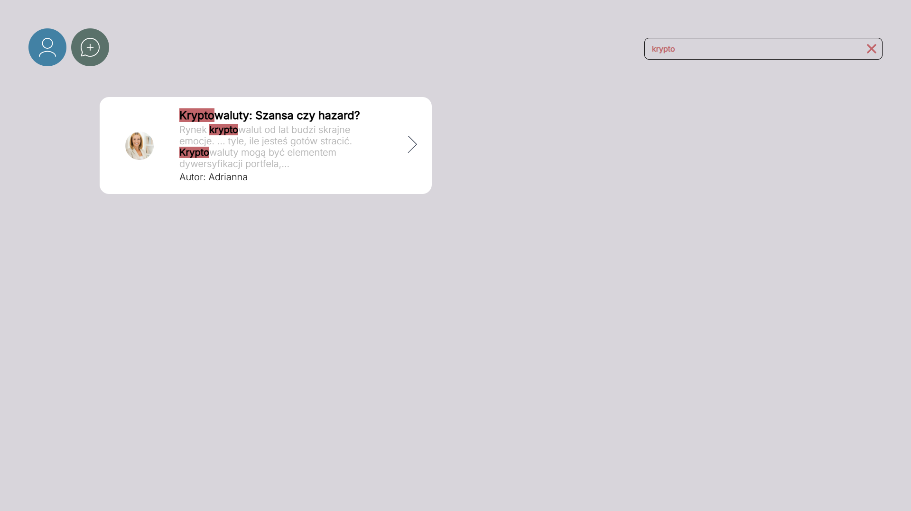
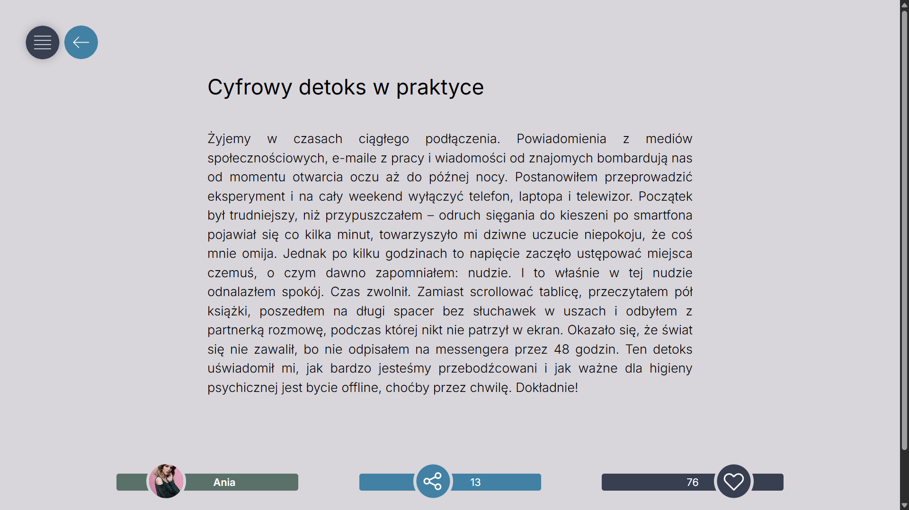
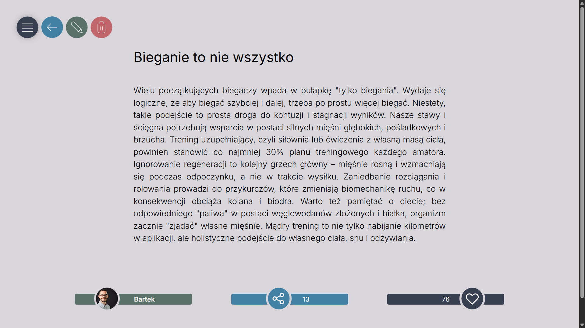
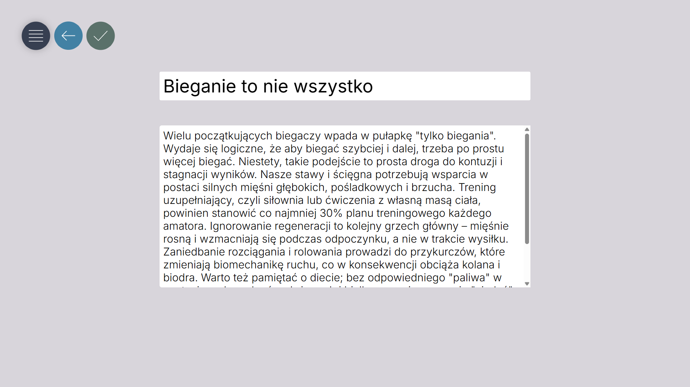
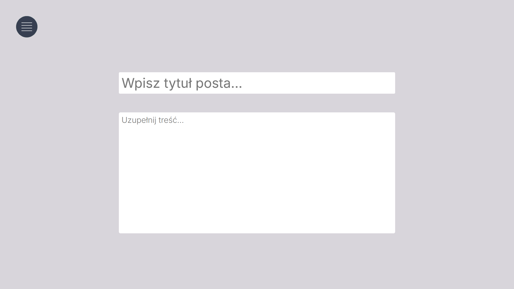
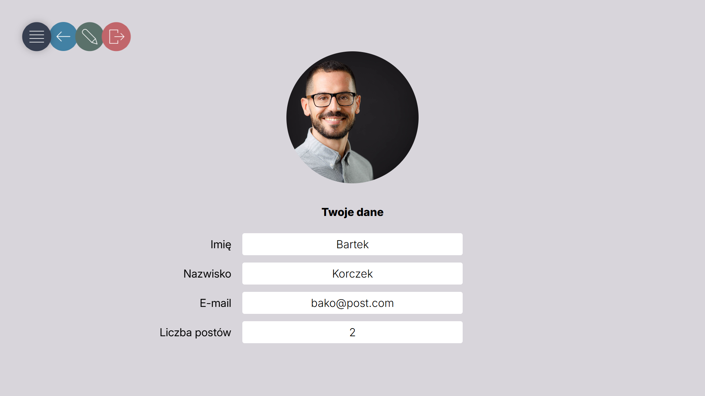
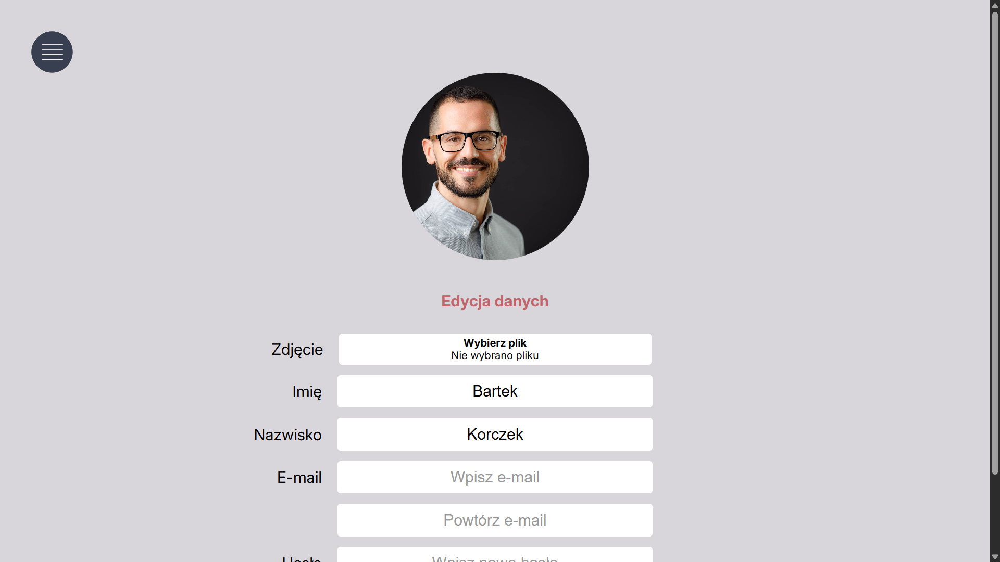
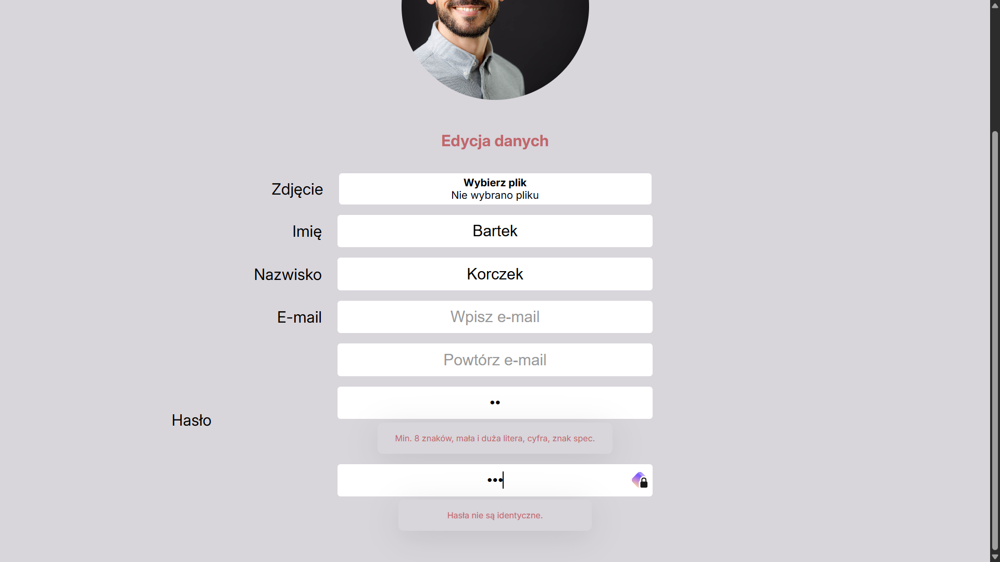

# Blogosfera

## Krótki opis

Aplikacja ma odtwarzać funkcjonalność prostego bloga, tj. pozwolić użytkownikowi na dodawanie, przeglądanie, edycję, usuwanie i przeszukiwanie postów.
Umożliwia mu także edycję danych powiązanych z jego kontem.
Zapewnia bezpieczeństwo m.in. poprzez rejestrację i logowanie.

## Technologie
* php
* html
* css
* docker

## Instalacja

1. Upewnij się, że masz zainstalowany **Docker** oraz **Docker Compose**.
2. Sklonuj repozytorium (lub pobierz pliki projektu).
3. W głównym katalogu projektu uruchom terminal i wpisz komendę budującą i uruchamiającą kontenery:
   `docker compose up -d --build`
4. Aplikacja powinna być dostępna pod adresem: `http://localhost:8080`

## Aplikacja

### Ekran logowania

Na początku wita nas ekran logowania. Możemy skorzystać z opcji "Nowy użytkownik?", aby przejść do panelu rejestracji.

## Panel rejestracji
Tutaj można dodawać nowych użytkowników. Formularz zawiera wszystkie potrzebne walidacje:
* niezgodność emaili
* niezgodność haseł
* zbyt słabe hasło
* podany e-mail istnieje w bazie (dyskretny komunikat bez zdradzania powodu błędu)

## Strona główna

Po zalogowaniu, zostajemy przekierowani na stronę główną. Tutaj możemy przeglądać posty, a także przesukiwać ich treść.

## Podgląd posta

Jeśli jesteśmy autorami posta, pojawiają się ikonki do edycji lub usunięcia. Taka sytuacja nie będzie miała miejsca, jeśli przeglądamy post, którego autorami nie jesteśmy. Natomiast ADMINISTRATOR ma możliwość edycji bądź skasowania dowolnego posta.

## Dodawanie posta

Ze strony głównej możemy także przejść do panelu dodawania posta.

## Podgląd danych konta użytkownika

Po kliknięciu w ikonkę konta, możemy przeglądać dane użytkownika, który jest zalogowany.
Po najechaniu na hamburger menu, wysuną się ikonki umożliwiające edycję danych lub wylogowanie.

## Edycja danych konta

Można tutaj zmienić zdjęcie profilowe lub inne dane dotyczące konta.
Formularz zawiera walidację danych.

## Konta testowe

### Administratorzy
admin@test.com, hasło: Administ1!

### Użytkownicy
ania@mejl.com, hasło: aniakowal

bako@post.com, hasło: Korczek1!

gold@user.pl, hasło: Goldmann1!

robert@post.com, hasło: Robert1!
